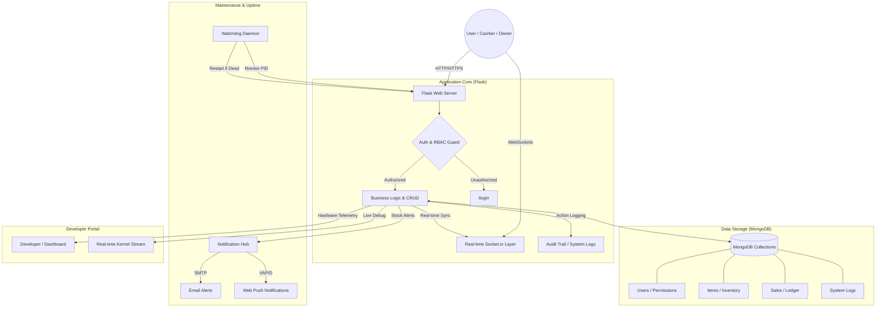

# FBIHM Inventory Engine: Master Knowledge Base (AI Training Data)

This document contains the consolidated documentation for the FBIHM Inventory Engine project. It is intended for AI consumption, context injection, or training.

---

# SECTION 1: THESIS & CORE GUIDE (thesis.md)

# The Simple Guide to the FBIHM Inventory Engine
*(Perfect for explaining your thesis to anyone!)*

Imagine you own a **Toy Store**. This project is like a **Magic Notebook** that helps you run that store without making any mistakes.

---

## 1. What is this project?
In the old days, store owners used paper notebooks. They would write down: *"I sold 1 car today."* But sometimes they forgot, or they lost the book!

**FBIHM** is a digital version of that notebook. It lives on a computer, it never forgets, and it does all the math for you.

---

## 2. The Three "Superpowers" of the System

### Superpower 1: The Smart Cash Register (POS)
When a customer comes to buy a toy, the cashier just clicks a button. 
- **Simple explanation:** It’s like a calculator that also talks to your toy shelf. When you click "Sell," the shelf automatically knows there is one less toy.

### Superpower 2: Magic Walkie-Talkies (Real-Time)
If you have two cash registers, they need to talk to each other.
- **Simple explanation:** If Register A sells the last Teddy Bear, Register B finds out **instantly** through a "magic walkie-talkie" (we call this **SocketIO**). Register B will show a red light saying "Out of Stock!" before the cashier even tries to sell it.

### Superpower 3: The Robot Guard (Watchdog)
Sometimes computers get tired and stop working (crash).
- **Simple explanation:** We have a **Robot Guard** script. Every 10 seconds, it pokes the system and asks, *"Are you awake?"* If the system fell asleep, the Robot Guard wakes it up immediately so the store can keep selling!

---

## 3. How we built it (The Tools)

| The Tool | What it is in "Kid Language" | Technical Name |
| :--- | :--- | :--- |
| **Python** | The **Manager** who makes all the decisions. | **Primary Backend Language** |
| **Flask** | The **Office** where the Manager works. | Web Framework (Python) |
| **JavaScript** | The **Magic Tricks** that make buttons move. | **Frontend Scripting Language** |
| **MongoDB** | The **Giant Toy Box** where we store all our notes. | Database (NoSQL) |
| **HTML/CSS** | The **Paint and Wallpaper** that make the store look pretty. | Layout & Style |

**Note on Modern Tech:** While things like **Next.js** or **TypeScript** are popular, we chose **Python/Flask** and **Vanilla JavaScript** because they are lightweight, fast to run on smaller computers, and very reliable for this specific store manager!

---

## 4. A Real-Life Example (How it works)

Let's say you have **10 Apples** in your store.

1.  **The Customer:** A kid wants to buy **2 Apples**.
2.  **The Cashier:** Opens the **FBIHM POS screen**, clicks "Apple" twice, and types in "₱20" (the money the kid gave).
3.  **The System (The Manager):** 
    - Checks the Toy Box: *"Do we have 10 apples? Yes!"*
    - Does the math: *10 minus 2 equals 8.*
    - Updates the Toy Box: *"We now have 8 apples left."*
4.  **The Receipt:** A little paper (or PDF) pops out saying: *"You bought 2 Apples. Change: ₱0. Thank you!"*
5.  **The Dashboard:** Instantly, the owner's computer updates a graph showing: *"Yay! You made ₱20 profit today!"*

---

## 5. Frequently Asked Questions (The "Thesis" Part)

**Q: Did you use Next.js or Node.js?**
**A:** No. We used **Python (Flask)** for the server and **Vanilla JavaScript** for the browser. This is because Python is much better at doing math and organizing data for business reports.

**Q: Why not use TypeScript?**
**A:** We used standard **JavaScript (ES6+)**. For this project, standard JavaScript provided all the speed and features we needed to make the "Magic Walkie-Talkies" (SocketIO) and "Smart Cash Register" work perfectly without adding extra complexity.

**Q: Why use a "NoSQL" Database?**
**A:** Because some toys are different! A "Car" has a color, but a "Book" has an author. A NoSQL database lets us put different kinds of "notes" in the same box easily.

---

## 6. Teacher's Corner: In-Depth Q&A for the FBIHM Inventory Engine

This section addresses anticipated questions regarding the technical decisions, challenges, and future direction of the FBIHM Inventory Engine, offering a more detailed perspective suitable for an academic review.

**Q1: Deep Dive into Technology Stack Choices – Why Python/Flask and Vanilla JavaScript, especially given the rise of modern alternatives like Next.js or dedicated frontend frameworks?**

**A1:** Our decision to employ Python with the Flask framework for the backend and Vanilla JavaScript for the frontend was a deliberate architectural choice, carefully weighed against the benefits of more contemporary full-stack frameworks like Next.js, or single-page application (SPA) frameworks like React, Vue, or Angular coupled with TypeScript. The primary objective of the FBIHM Inventory Engine was to deliver a robust, real-time inventory and point-of-sale solution optimized for deployment on affordable, resource-constrained local hardware, such as single-board computers (SBCs) or older desktop systems often found in small businesses.

**Backend (Python/Flask):**
Flask, as a micro-framework, provided the necessary flexibility and minimal overhead that larger frameworks like Django might introduce. Python's strength in data manipulation, business logic, and reporting made it an ideal choice for the core inventory management and sales analytics. For an application heavily focused on transactional data, calculations, and backend processing, Python's ecosystem, particularly its libraries for data science and reporting, offered a distinct advantage. While frameworks like Next.js excel in full-stack JavaScript development, their server-side rendering (SSR) and API routing capabilities, while powerful, often come with a larger memory footprint and CPU demand, which could impact performance on our target hardware. The explicit instruction to optimize for "smaller computers" guided us towards a leaner backend. Flask's lightweight nature meant quicker startup times and lower runtime resource consumption, directly addressing this requirement. Furthermore, the development velocity for creating RESTful APIs and integrating with MongoDB was excellent using Flask, allowing us to focus on core business features rather than framework-specific boilerplate.

**Frontend (Vanilla JavaScript, HTML, CSS):**
The choice of Vanilla JavaScript (ES6+) over a component-based framework like React or a language extension like TypeScript was also driven by the optimization for local hardware and simplicity of deployment. For an application that primarily acts as an interactive client for a local backend, the overhead of a large JavaScript framework bundle could translate to slower initial load times and increased memory usage in the browser. Vanilla JS allowed for highly optimized and direct manipulation of the DOM, resulting in a snappier and more responsive user experience, especially on older browsers or less powerful client devices. The "Magic Walkie-Talkies" (SocketIO) real-time functionality was implemented directly using standard browser APIs and the Socket.IO client library, demonstrating that powerful, interactive features do not always necessitate a heavy framework. TypeScript, while offering significant benefits in large, complex codebases for type safety and maintainability, would have introduced a build step and additional complexity that was deemed unnecessary for the initial scope and target environment of FBIHM. Our aim was to build a system that is easy to understand, debug, and maintain without needing a sophisticated build pipeline, further reinforcing the choice of vanilla tooling.

**Contrast with Next.js and D1 (Future State):**
It is crucial to acknowledge the evolving landscape of web development and our future vision. The current architecture prioritizes on-premise performance and resource efficiency. However, in anticipation of scaling the FBIHM Inventory Engine for a wider audience and leveraging cloud infrastructure, a migration to Next.js on Cloudflare Pages with D1 (SQL) is a logical next step.

*   **Next.js** would provide:
    *   **Server-Side Rendering (SSR) / Static Site Generation (SSG):** Significantly improved initial load performance and SEO capabilities, crucial for a public-facing application.
    *   **File-system based routing and API routes:** Streamlined development for a more complex application with numerous pages and API endpoints.
    *   **Optimized bundle splitting and image optimization:** Enhanced user experience for web clients.
    *   **React ecosystem:** Access to a vast library of UI components and development tools for building rich, interactive user interfaces.
*   **Cloudflare Pages & D1 (SQLite-compatible relational database):**
    *   **Global CDN deployment:** Low latency access for users worldwide.
    *   **D1:** Offers ACID compliance, strong relational integrity, and a more structured approach to complex data relationships, which becomes increasingly valuable as the application grows and data models become more intricate (e.g., detailed reporting, complex supplier management). This directly contrasts with MongoDB's flexible schema, which was ideal for the initial, evolving data structures but might become challenging with strict business rules. The relational model will facilitate more complex queries and ensure data consistency in a distributed cloud environment.

In summary, our current stack was meticulously chosen for its immediate advantages in a specific deployment scenario, offering a lean, performant, and reliable solution. The planned migration reflects an intelligent adaptation to future scalability and deployment needs, demonstrating a comprehensive understanding of technological trade-offs and project lifecycle management.

**Q2: Explain the rationale behind using MongoDB as a NoSQL database for an inventory management system. What are the advantages and disadvantages compared to a traditional relational database, especially considering the eventual migration to a relational database like D1 (SQL)?**

**A2:** The initial decision to implement MongoDB, a NoSQL document-oriented database, for the FBIHM Inventory Engine was primarily driven by its flexibility and scalability, which aligned perfectly with the early stages of a dynamic inventory management system. Inventory data, especially in a toy store scenario, can often be heterogeneous. A "car" item might have properties like `color` and `brand`, while a "book" might have `author`, `genre`, and `ISBN`. A "plush toy" might have `material` and `stuffing_type`.

**Advantages of MongoDB (NoSQL) for Initial Development:**

1.  **Flexible Schema (Schema-less):** This was a significant advantage during the initial development phase. It allowed us to rapidly iterate on product features without being constrained by rigid schema definitions. As the inventory items evolved, adding new attributes (e.g., `battery_type` for electronic toys, `edition` for collectible items) was straightforward and did not require costly database migrations. This agility accelerated development and allowed for quick adaptation to new business requirements.
2.  **Ease of Data Representation:** Storing documents in a JSON-like format (`BSON` in MongoDB) directly mapped to our application's object models in Python, reducing the need for complex ORM (Object-Relational Mapping) layers. This made data persistence and retrieval intuitive and performant for our use cases.
3.  **Horizontal Scalability (Sharding):** While not immediately necessary for a local deployment, MongoDB’s inherent design for horizontal scaling through sharding provides a clear path for handling large volumes of data and high read/write loads in a distributed environment, should the system grow significantly.
4.  **Performance for Read/Write Operations:** For many inventory operations (adding a new item, updating stock levels, querying by item ID), MongoDB can offer high performance due to its document-oriented nature and efficient indexing.

**Disadvantages and Comparison with Relational Databases (like D1/SQL):**

Despite its advantages, MongoDB also presents certain trade-offs, particularly when compared to traditional relational databases (SQL), which become more apparent as a system matures and requires stronger data integrity guarantees.

1.  **Lack of Strong ACID Compliance (for complex transactions):** While MongoDB supports atomic operations on a single document, multi-document transactions were historically more complex or limited. For intricate inventory operations involving multiple related records (e.g., a sale updating stock, sales history, and customer loyalty points simultaneously across different collections), maintaining strict ACID (Atomicity, Consistency, Isolation, Durability) properties can be more challenging than in a relational database. SQL databases excel here, ensuring all or nothing for complex transactions.
2.  **Data Consistency Challenges:** The flexible schema, while an advantage for agility, can become a disadvantage for ensuring data consistency and integrity across an entire dataset. Without explicit schemas, it's easier for inconsistencies to creep into the data, which can complicate reporting and business logic. Relational databases enforce strict data types, relationships, and constraints (e.g., foreign keys), guaranteeing data integrity at the database level.
3.  **Complex Joins and Reporting:** While MongoDB offers aggregation pipelines, performing complex joins across multiple collections for sophisticated reporting can be less intuitive and potentially less performant than well-optimized SQL queries using JOIN operations. For an inventory system, complex reports on sales trends, product categories, and supplier performance are critical, and a relational model often simplifies these tasks.
4.  **Learning Curve for Relational-Minded Developers:** Developers accustomed to relational database concepts might find the denormalization patterns and aggregation frameworks of NoSQL databases to have a different learning curve.

**Rationale for Future Migration to D1 (SQL):**

The planned migration to D1, a SQLite-compatible relational database on Cloudflare Pages, is a strategic move to address the long-term needs of the FBIHM Inventory Engine as it moves from a local prototype to a scalable, cloud-native application.

*   **Data Integrity:** As the business logic evolves and becomes more complex, strong data integrity, guaranteed by relational constraints and ACID transactions, becomes paramount. This ensures consistency across all related inventory and sales records.
*   **Structured Data and Relationships:** While initial inventory might be heterogeneous, core entities like `Products`, `Orders`, `Customers`, and `Suppliers` inherently have well-defined relationships. A relational database is naturally suited to model these relationships efficiently and allow for complex querying and reporting without the overhead of aggregation pipelines.
*   **SQL's Power for Analytics:** SQL remains the gold standard for querying and analyzing structured data. For advanced business intelligence and reporting, a relational backend provides unparalleled power and flexibility.
*   **Cloud-Native Integration:** D1's integration with Cloudflare Pages offers a serverless, highly distributed, and low-latency database solution that aligns with modern web application deployment strategies, ensuring performance and availability at a global scale.

In conclusion, MongoDB was an excellent choice for rapid prototyping and handling evolving data structures in a localized deployment. However, for a future-proof, scalable, and globally accessible inventory system with increasingly complex business logic and reporting needs, the shift to a relational database like D1 offers superior data integrity, structured querying capabilities, and seamless integration with a modern cloud platform. This two-phase approach showcases a pragmatic and forward-thinking strategy for software development.

**Q3: Describe the "Magic Walkie-Talkies" (SocketIO) feature. How does it ensure real-time inventory synchronization across multiple Point-of-Sale (POS) terminals, and what were the key challenges in its implementation?**

**A3:** The "Magic Walkie-Talkies" feature, implemented using **Socket.IO**, is the cornerstone of the FBIHM Inventory Engine's real-time capabilities. In a busy retail environment, especially one with multiple Point-of-Sale (POS) terminals, immediate and accurate inventory synchronization is critical. Without it, a scenario where two cashiers accidentally sell the last item simultaneously (a "phantom stock" issue) could lead to customer dissatisfaction and operational discrepancies. Socket.IO addresses this by establishing a persistent, bidirectional communication channel between the server and all connected client applications (e.g., POS terminals, owner's dashboard).

**Mechanism for Real-time Synchronization:**

1.  **Persistent Connection:** Unlike traditional HTTP requests, which are stateless and open a new connection for each request, Socket.IO maintains a persistent WebSocket connection (falling back to other methods if WebSockets are not supported) between the Flask server and each client. This "always-on" connection allows for instantaneous data push from the server to clients.
2.  **Event-Driven Communication:** Socket.IO operates on an event-driven model. The server can "emit" events, and clients can "listen" for these events. Conversely, clients can also emit events to the server.
3.  **Inventory Update Workflow:**
    *   **Sale Event:** When a sale is processed at any POS terminal, the Flask backend receives the transaction details.
    *   **Database Update:** The backend first updates the stock level for the sold item in the MongoDB database. This is the source of truth.
    *   **Broadcast Event:** Crucially, *after* the database update, the Flask server emits a Socket.IO event (e.g., `item_stock_updated`) to *all* connected clients. This event includes the ID of the item and its new stock quantity.
    *   **Client-Side Reaction:** Each POS terminal and the owner's dashboard (which are listening for `item_stock_updated` events) immediately receives this broadcast. Upon reception, the client-side JavaScript code updates its local display. For instance, if a Teddy Bear's stock goes from 1 to 0, all terminals will instantly show the Teddy Bear as "Out of Stock" (the "red light" metaphor). This prevents other cashiers from attempting to sell an item that is no longer available.
4.  **Dashboard Integration:** The owner's dashboard also leverages Socket.IO to receive real-time updates on sales, profit margins, and inventory changes, providing an up-to-the-minute overview of business performance without requiring manual page refreshes.

**Key Challenges in Implementation:**

1.  **Connection Management and Reliability:** Ensuring stable, persistent connections across varying network conditions was a primary concern. Socket.IO handles much of this automatically (e.g., reconnection attempts), but careful server configuration and client-side error handling were necessary to manage dropped connections gracefully and prevent data desynchronization. For local network deployments, stability is generally high, but we had to account for brief network interruptions.
2.  **Event Design and Data Payload:** Designing a clear and efficient event structure was important. Overly broad events could lead to unnecessary client-side processing, while overly granular events could increase network traffic. Balancing the event types (e.g., a generic `inventory_update` vs. `item_stock_updated`, `new_sale_recorded`) and their data payloads (sending only necessary information) was a design challenge.
3.  **Concurrency and Race Conditions:** Even with real-time updates, careful handling of concurrency on the backend was vital. If multiple sale requests for the same item arrive almost simultaneously, the database update logic needs to be robust to prevent race conditions (e.g., using atomic operations for decrementing stock) to ensure that the database's record of stock is always accurate before the Socket.IO event is broadcast. Python's Global Interpreter Lock (GIL) and Flask's request handling model, combined with atomic MongoDB operations, helped mitigate some of these concerns, but thorough testing was essential.
4.  **Scalability of Real-time Layer:** While a local deployment might not heavily tax the Socket.IO server, envisioning future scalability necessitated an understanding of how Socket.IO scales. For a multi-server deployment (which would be the case in a cloud environment), a message broker like Redis is typically used to enable inter-server communication for Socket.IO, ensuring that all clients receive broadcast events regardless of which application server they are connected to. This was a consideration for the future architecture.
5.  **Client-Side Responsiveness:** The JavaScript on the client side needed to be efficient in processing incoming Socket.IO events and updating the UI without causing lag or freezing the application, especially on less powerful client devices. This involved optimizing DOM manipulation and avoiding heavy computations directly in event handlers.

In conclusion, Socket.IO proved to be an indispensable tool for achieving the real-time, synchronized experience vital for the FBIHM Inventory Engine. While its implementation required careful consideration of connection management, event design, and concurrency, the benefits of instant feedback and accurate inventory tracking across all points of interaction significantly enhance the system's operational efficiency and user experience.

**Q4: Data Structures in MongoDB - How are critical entities like inventory items, sales transactions, and user data structured within MongoDB, and what are the advantages of this schema design for the FBIHM Inventory Engine?**

**A4:** In the FBIHM Inventory Engine, our data modeling in MongoDB is designed to leverage its document-oriented nature, providing flexibility and efficiency for an inventory management system where item attributes can vary significantly. Instead of rigid tables, we use collections of JSON-like documents.

**Inventory Items (`items` collection):**
Each inventory item (e.g., a "Toy Car" or a "Story Book") is represented as a single, rich document.
```json
{
    "_id": ObjectId("60d5ec49f1c7d2c3e4b5a6c7"),
    "name": "Sparkle Unicorn Plush",
    "sku": "SU001",
    "category": "Plush Toys",
    "current_stock": 50,
    "unit_price": 15.99,
    "supplier_id": ObjectId("60d5ec49f1c7d2c3e4b5a6c8"),
    "attributes": {
        "color": "Rainbow",
        "material": "Polyester",
        "size": "Medium"
    },
    "sales_data": { // Embedded sub-document for quick access to sales stats
        "total_sold": 120,
        "last_sale_date": ISODate("2026-03-27T10:30:00Z")
    },
    "history": [ // Embedded array for recent stock changes
        {"type": "in", "qty": 100, "date": ISODate("2025-12-01T09:00:00Z"), "reason": "Initial stock"},
        {"type": "out", "qty": 5, "date": ISODate("2026-01-15T14:00:00Z"), "reason": "Sale"}
    ]
}
```
**Advantages of this schema for inventory:**
*   **Flexible Attributes:** The `attributes` field can hold varying properties for different product types without requiring schema changes. A "book" might have `author` and `genre`, while a "toy" has `color` and `material`. This `schema-on-read` approach is perfect for diverse product catalogs.
*   **Denormalization for Performance:** Embedding `sales_data` and `history` directly within the item document allows for single-query retrieval of most item-related information. This avoids costly joins often associated with relational databases, making read operations for product details very fast.
*   **Atomic Updates:** Stock levels (`current_stock`) can be updated atomically using MongoDB's `$inc` operator, ensuring data consistency even with concurrent sales from multiple POS terminals.

**Sales Transactions (`sales` collection):**
Each sale is a document that captures the details of a single transaction.
```json
{
    "_id": ObjectId("60d5ed02f1c7d2c3e4b5a6ca"),
    "transaction_id": "TXN-20260327-001",
    "sale_date": ISODate("2026-03-27T10:35:00Z"),
    "cashier_id": ObjectId("60d5ec49f1c7d2c3e4b5a6c9"),
    "total_amount": 35.98,
    "items_sold": [
        {
            "item_id": ObjectId("60d5ec49f1c7d2c3e4b5a6c7"),
            "sku": "SU001",
            "name": "Sparkle Unicorn Plush",
            "qty": 2,
            "unit_price": 15.99,
            "subtotal": 31.98
        },
        {
            "item_id": ObjectId("60d5ed02f1c7d2c3e4b5a6cc"),
            "sku": "TB002",
            "name": "Giant Teddy Bear",
            "qty": 1,
            "unit_price": 4.00,
            "subtotal": 4.00
        }
    ],
    "payment_method": "Cash",
    "customer_info": { // Optional, depending on privacy/CRM
        "name": "Jane Doe"
    }
}
```
**Advantages for sales:**
*   **Self-Contained Records:** Each sales document is a complete record of a transaction, making it easy to audit and retrieve without needing to join across multiple collections.
*   **Flexible Line Items:** `items_sold` is an embedded array, perfectly suited for storing a variable number of products in each sale.

**User Data (`users` collection):**
Simple user profiles for authentication and role-based access.
```json
{
    "_id": ObjectId("60d5ec49f1c7d2c3e4b5a6c9"),
    "username": "cashier1",
    "email": "cashier1@store.com",
    "password_hash": "hashed_password_string",
    "role": "cashier",
    "created_at": ISODate("2025-11-20T08:00:00Z"),
    "last_login": ISODate("2026-03-27T10:30:00Z")
}
```
**Advantages for users:**
*   Straightforward document for user profiles, easy to extend with new fields like `preferences` or `permissions` without altering a fixed table structure.

**Overall Data Structure Advantages for FBIHM:**
The document model allowed for rapid development and adaptation to evolving business needs, especially in the early stages where product types and their attributes might not be fully standardized. The judicious use of embedding (e.g., `attributes`, `sales_data`, `history` in `items`) significantly reduced the need for complex database-side joins, boosting query performance for common access patterns. This aligns with MongoDB's strengths and the project's goal of a lightweight, responsive system.

**Q5: Core Business Logic and Algorithms - Beyond standard CRUD operations, are there specific functions or algorithms critical to the FBIHM Inventory Engine's core business logic, such as ensuring stock accuracy during concurrent sales or generating complex reports? How are they implemented and what libraries support them?**

**A5:**
While the FBIHM Inventory Engine performs many standard CRUD (Create, Read, Update, Delete) operations, its core strength lies in its ability to handle business-critical logic, particularly around real-time stock management and comprehensive reporting. These functionalities are driven by specific functions and the intelligent application of underlying libraries.

**1. Concurrent Stock Management and Atomicity (Ensuring Accuracy):**
One of the most critical aspects of any inventory system is preventing "phantom stock" scenarios, especially with multiple POS terminals. Our system addresses this through:

*   **Atomic Database Operations:** When a product is sold, the stock reduction is not a simple read-modify-write operation, which could lead to race conditions. Instead, we use MongoDB's atomic operators, specifically `$inc`.
    *   **Implementation (`core/db.py` logic example):**
        ```python
        # Hypothetical function in core/db.py
        def decrement_stock(item_id, quantity_to_decrement):
            result = mongo.db.items.update_one(
                {"_id": item_id, "current_stock": {"$gte": quantity_to_decrement}}, # Check if enough stock
                {"$inc": {"current_stock": -quantity_to_decrement, "sales_data.total_sold": quantity_to_decrement}}
            )
            return result.modified_count > 0 # Returns true if stock was successfully decremented
        ```
    *   **Explanation:** The `update_one` operation is atomic. The `current_stock": {"$gte": quantity_to_decrement}` condition acts as a safeguard. If `current_stock` is less than `quantity_to_decrement` at the moment of the update (meaning another concurrent sale just took the last item), the update operation will not proceed, and `modified_count` will be 0. This guarantees that stock can never go negative due to simultaneous transactions, and only one sale can claim the last available item.
*   **Real-time Notification (`routes/pos.py` or `sockets.py` logic):** Immediately after a successful atomic stock decrement, the system emits a Socket.IO event.
    *   **Implementation:**
        ```python
        # After successful decrement in a Flask route or socket event handler
        from flask_socketio import emit
        # ... (logic to get updated item details)
        emit('item_stock_updated', {'item_id': str(item_id), 'new_stock': updated_stock}, broadcast=True, namespace='/')
        ```
    *   **Libraries Involved:** `pymongo` (for atomic operations), `Flask-PyMongo` (for Flask integration), `Flask-SocketIO` (for real-time communication), `Eventlet`/`Greenlet` (for concurrent handling of socket connections).

**2. Sales Processing and Reporting Algorithms:**
The system generates various reports to provide insights into sales performance and inventory health. These involve aggregation and calculation algorithms.

*   **Daily/Weekly/Monthly Sales Summary:** This algorithm aggregates sales data over a specified period.
    *   **Implementation (`routes/sales.py` logic example):**
        ```python
        # Hypothetical function for sales summary
        def get_sales_summary(start_date, end_date):
            pipeline = [
                {"$match": {"sale_date": {"$gte": start_date, "$lte": end_date}}},
                {"$unwind": "$items_sold"},
                {"$group": {
                    "_id": {"$dateToString": {"format": "%Y-%m-%d", "date": "$sale_date"}},
                    "total_sales_value": {"$sum": "$items_sold.subtotal"},
                    "total_items_sold": {"$sum": "$items_sold.qty"}
                }},
                {"$sort": {"_id": 1}}
            ]
            return list(mongo.db.sales.aggregate(pipeline))
        ```
    *   **Explanation:** This uses MongoDB's Aggregation Framework, a powerful pipeline for data transformation. It first filters sales by date, then "unwinds" the `items_sold` array to process each product individually, and finally "groups" by date to sum up sales values and quantities.
    *   **Libraries Involved:** `pymongo`, `Flask-PyMongo` (for aggregation queries), `pandas` (for further post-processing, e.g., creating data frames from the aggregated results for more complex analysis), `openpyxl`/`fpdf2` (for exporting these summaries into accessible formats).
*   **Low Stock Alerts:** A simple algorithm periodically checks inventory levels against a predefined threshold.
    *   **Implementation (possibly in a background task or part of the "Robot Guard"):**
        ```python
        def check_low_stock(threshold=10):
            low_stock_items = mongo.db.items.find({"current_stock": {"$lte": threshold}})
            for item in low_stock_items:
                # Trigger notification (e.g., email, push notification via pywebpush)
                print(f"ALERT: {item['name']} (SKU: {item['sku']}) is low on stock ({item['current_stock']} left)!")
        ```
    *   **Libraries Involved:** `pymongo`, `psutil` (if run as part of the system monitor, though `psutil` is more for system-level stats), `pywebpush` (for web push notifications).

**3. Watchdog ("Robot Guard") Algorithm:**
The "Robot Guard" (`watchdog.sh` and `psutil` in Python) is a critical component for system resilience.

*   **Implementation:** The `watchdog.sh` script periodically executes a Python script that uses `psutil` to check if `app.py` (the main Flask application) is running.
    *   **Python part (`extensions.py` or a dedicated watchdog script):**
        ```python
        import psutil
        import os

        def is_app_running(pid_file='app_pid.txt'):
            if not os.path.exists(pid_file):
                return False
            with open(pid_file, 'r') as f:
                pid = int(f.read().strip())
            try:
                process = psutil.Process(pid)
                # Check if it's our app process
                # Could add more robust checks like process.name() or cmdline()
                return process.is_running() and 'app.py' in ' '.join(process.cmdline())
            except psutil.NoSuchProcess:
                return False

        if not is_app_running():
            # Logic to restart the Flask application (e.g., using os.system or subprocess)
            print("App not running, attempting restart...")
            # This would typically be handled by the shell script or a more robust process manager
        ```
    *   **Shell Script part (`watchdog.sh`):** This script would contain `if` conditions to check the Python script's output and restart the main `app.py` (often via `gunicorn` or directly with `python app.py`) if it's not detected as running.
*   **Explanation:** This simple yet effective algorithm ensures high availability by automatically detecting and restarting the core application if it crashes.
*   **Libraries Involved:** `psutil` (for process monitoring).

These examples highlight how specific data structures enable efficient operations and how various libraries are integrated to implement the core business logic, ensuring the FBIHM Inventory Engine is not just functional but robust and reliable.

---

## 7. Technical Dependencies (Libraries Used)

The FBIHM Inventory Engine leverages a variety of Python libraries to provide its functionality. These dependencies are managed via `requirements.txt` and include:

*   **Flask (`Flask`):** The foundational micro-web framework for Python. It provides the core structure for our backend application, handling HTTP requests, routing, and serving web pages. Its lightweight nature was key to optimizing performance on resource-constrained hardware.
*   **Flask-PyMongo (`Flask-PyMongo`):** An essential extension that integrates MongoDB with Flask applications. It simplifies database connections and operations, allowing our Flask routes to easily interact with the inventory data stored in MongoDB.
*   **PyMongo (`pymongo`):** The official Python driver for MongoDB. While Flask-PyMongo provides a high-level interface, `pymongo` is the underlying library for direct and powerful interactions with the MongoDB database, ensuring efficient data storage and retrieval.
*   **Flask-SocketIO (`Flask-SocketIO`):** Enables real-time, bidirectional communication between the web browser and the Flask server. This is the technology behind our "Magic Walkie-Talkies," ensuring instant updates across all connected Point-of-Sale (POS) terminals and the central dashboard.
*   **python-engineio / python-socketio:** Core libraries that `Flask-SocketIO` builds upon, providing the low-level Engine.IO and Socket.IO protocol implementations for real-time communication.
*   **Eventlet / Greenlet (`eventlet`, `greenlet`):** These libraries provide the necessary concurrency model for `Flask-SocketIO` to handle multiple simultaneous client connections efficiently without blocking the main application thread, crucial for a responsive real-time system.
*   **Gunicorn (`gunicorn`):** A robust WSGI (Web Server Gateway Interface) HTTP server for Unix. It is used in production deployments to serve the Flask application, managing multiple worker processes for improved performance and reliability.
*   **python-dotenv (`python-dotenv`):** Simplifies the management of environment variables, allowing us to configure settings (like database connection strings or API keys) securely outside the codebase, which is vital for both development and deployment.
*   **Jinja2 (`Jinja2`):** The powerful templating engine used by Flask. It allows for dynamic generation of HTML pages by embedding Python logic directly into the templates, creating the user interfaces for our POS and dashboard.
*   **Werkzeug (`Werkzeug`):** A comprehensive WSGI utility library that Flask is built upon. It provides essential tools for building web applications, including request and response objects, URL routing, and a debugging WSGI middleware.
*   **itsdangerous (`itsdangerous`):** A utility belt for various security-related tasks in web applications, such as signing data to protect against tampering. Flask uses it for features like session management.
*   **Click (`click`):** A command-line interface creation kit. Flask integrates with Click to provide convenient command-line tools for application management and development tasks.
*   **fpdf2 (`fpdf2`):** A library for generating PDFs. This is used to create printable receipts and reports directly from the system, a critical feature for business operations.
*   **pandas (`pandas`):** A powerful data manipulation and analysis library. It's used for processing and structuring data for complex reports and analytics, enabling the system to generate insights from sales and inventory data.
*   **openpyxl (`openpyxl`):** A library to read and write Excel 2010 xlsx/xlsm/xltx/xltm files. This allows for importing inventory data from spreadsheets and exporting reports in a widely used format.
*   **python-docx (`python-docx`):** A library for creating and updating Microsoft Word (.docx) files. This can be used for generating more structured documents or reports from the system.
*   **Requests (`requests`):** An elegant and simple HTTP library for Python. While not a core part of the primary web server, it's invaluable for making external API calls or fetching data from other services if needed.
*   **BeautifulSoup4 (`beautifulsoup4`) & Soupsieve (`soupsieve`):** Libraries for parsing HTML and XML documents. These are generally used for web scraping or extracting data from structured text, which could be utilized for importing product catalogs or other external data sources.
*   **Tqdm (`tqdm`):** A fast, extensible progress bar for Python. Used to provide visual feedback during long-running operations, enhancing the user experience for processes like large data imports or report generation.
*   **psutil (`psutil`):** A cross-platform library for retrieving information on running processes and system utilization (CPU, memory, disks, network). This library is instrumental in our "Robot Guard" (watchdog script) to monitor the health and activity of the system.
*   **Google AI/API related libraries (`google-generativeai`, `google-ai-generativelanguage`, `google-api-core`, `google-api-python-client`, `google-auth`, `google-auth-httplib2`, `googleapis-common-protos`):** These indicate potential integration with Google's artificial intelligence services or other Google APIs, likely for features such as advanced analytics, predictive inventory, or other intelligent functionalities.
*   **Web Push Notification related libraries (`pywebpush`, `http_ece`, `py-vapid`):** These suggest the implementation of web push notifications, allowing the system to send real-time alerts or updates to users even when they are not actively using the application, for example, for critical stock alerts or sales notifications.
*   **Certifi (`certifi`), Charset-Normalizer (`charset-normalizer`), Idna (`idna`), Urllib3 (`urllib3`):** These are common underlying dependencies for secure and robust HTTP communication, ensuring that network requests are handled correctly and securely.

---

# SECTION 2: SYSTEM SUMMARY & PROCESS MAP (README.md)

# FBIHM Inventory Engine: System Summary & Process Map

## 🚀 Overview
The **FBIHM Inventory Engine (v2.5.1)** is a high-performance, real-time inventory management and Point-of-Sale (POS) system. Designed for small-to-medium enterprises (SMEs), it replaces manual record-keeping with an automated, self-healing digital platform built on Python, Flask, and MongoDB.

---

## 🗺️ System Process Map (Mermaid)



---

## 🌐 How the System Works: A 6-Step Breakdown
The FBIHM Inventory Engine operates through a layered architecture designed for speed, security, and reliability.

1.  **Entry & Authentication:** Users access the system via a secure login. The backend uses **Role-Based Access Control (RBAC)** to ensure that owners have full oversight while cashiers only see the tools they need (like the POS).
2.  **Point-of-Sale (POS) Interaction:** A cashier selects items. The system performs a **Real-time Stock Validation** to ensure the item is available before allowing the sale to proceed.
3.  **Atomic Processing:** Once "Checkout" is clicked, the server performs an **Atomic Operation** in MongoDB. It deducts stock, creates a sale record, and generates an audit log simultaneously to prevent data corruption.
4.  **Real-Time Synchronization:** Instantly, the server broadcasts a `dashboard_update` event via **Socket.io**. This updates the charts and stock badges on every connected computer in the building without refreshing the page.
5.  **Proactive Alerting:** If the sale causes an item to hit its "Low Stock Threshold," the **Notification Hub** automatically triggers an SMTP email alert to the store owner.
6.  **Self-Healing Supervision:** Throughout this process, the **Watchdog Daemon** runs in the background. If the database or server ever trips, the watchdog catches it and restarts the service in under 10 seconds.

---

## 🤖 Automation & Self-Healing
The system is built for **High Availability**, meaning it is designed to stay online 24/7 with zero human intervention.

### 1. **Watchdog script (`watchdog.sh`)**
- Monitors the Process ID (PID) of both the MongoDB database and the Flask web server.
- If a service stops, it logs the failure and executes a recovery command immediately.

### 2. **Metric Engine**
- Automatically calculates complex business metrics like **Profit Margin**, **Total Inventory Value**, and **Sales Velocity** every time the dashboard is viewed.

---

## 🎓 Educational Advantages: Why this Stack for Students?
The FBIHM project serves as a model for modern full-stack development methodologies.

- **Python & Flask:** Teaches "Micro-service" thinking and fundamental HTTP request handling without the complexity of heavy "Black-box" frameworks.
- **NoSQL (MongoDB):** Demonstrates the power of flexible data schemas, allowing students to understand how modern apps handle irregular data.
- **Event-Driven Architecture:** Introduces students to WebSockets and real-time state management, a critical skill for 2026 software engineering.

---

## 🛠️ Technical Components

-   **Backend:** Python 3.13, Flask 3.1.3, Eventlet.
-   **Database:** MongoDB (NoSQL) with PyMongo driver.
-   **Real-time:** Flask-SocketIO (WebSockets).
-   **Frontend:** HTML5, CSS3 (Flexbox/Grid), Bootstrap 5.3, Vanilla JavaScript.
-   **Visuals:** Chart.js for data visualization.
-   **Automation:** Bash Scripting for system-level monitoring.

---

## 🔑 Security Architecture
-   **Data Protection:** PBKDF2 Password Hashing with Salts.
-   **Traffic Security:** Strict **Content Security Policy (CSP)** and **X-Frame-Options** to prevent XSS and Clickjacking.
-   **Operational Security:** **Code 67** authorization guard for sensitive administrative changes.
-   **Accountability:** Global Audit Trail tracking user actions, timestamps, and IP addresses.

---

# SECTION 3: DEFENSE CHEATSHEET (cheatsheet.md)

# 🎓 Thesis Defense Cheatsheet: FBIHM Inventory Engine

This is your "Quick Reference" guide for the defense panel. Use this to find technical facts, project terminology, and key justifications in seconds.

---

## 🚀 1. The Project "DNA" (Fast Facts)
- **Official Name:** FBIHM Inventory Engine
- **Version:** 2.5.1 (Stable Core)
- **Primary Goal:** To bridge the gap between manual record-keeping and complex enterprise software for local SMEs.
- **Port:** 5000 (Internal)
- **Deployment:** Local Linux Server with Cloud-Synchronized Database (MongoDB Atlas).

---

## 💻 2. Technology Stack (The "How")
| Layer | Technology Used | Why? |
| :--- | :--- | :--- |
| **Backend** | **Python 3.13** | Powerful for data logic and math. |
| **Framework** | **Flask 3.1.3** | Micro-framework; lightweight and modular. |
| **Database** | **MongoDB (NoSQL)** | Flexible; handles diverse item categories easily. |
| **Real-Time** | **Socket.io** | Instant updates across all connected screens. |
| **Frontend** | **Vanilla JS (ES6+)** | Fast browser performance without heavy frameworks. |
| **UI Styling** | **Bootstrap 5.3** | Responsive design; works on tablets and desktops. |
| **Server Engine** | **Eventlet** | Handles high-concurrency (multiple POS terminals). |

---

## 🏗️ 3. Architecture & Logic (The "Brain")
- **Pattern:** **MVC (Model-View-Controller)**. 
    - *Model:* MongoDB documents. 
    - *View:* Jinja2 HTML templates. 
    - *Controller:* Flask Blueprints (`auth`, `pos`, `sales`, `inventory`).
- **PWA (Progressive Web App):** Uses a **Service Worker (v4.0)** to implement an **Offline-First Viewer Mode**. It utilizes a **Stale-While-Revalidate** strategy to ensure the Dashboard, Items, and Sales pages remain viewable even without a network connection.
- **Self-Healing:** The `watchdog.sh` script polls the system every **10 seconds** to ensure the database and server are always running.
- **Connectivity UI:** A real-time listener in the navbar toggles a "Disconnected" banner and changes the sync icon color (Green to Red) based on actual browser connectivity state.

---

## 🔒 4. Security Shield
- **RBAC (Role-Based Access Control):** 
    - **Owner:** Full access (Profits, User Management).
    - **Cashier:** Restricted access (POS, Items, Bulletin).
- **Password Protection:** PBKDF2 hashing with salt (never stored in plain text).
- **Code 67:** A mandatory authorization code required for sensitive "Owner" modifications to prevent unauthorized local overrides.
- **CSP (Content Security Policy):** Blocks external scripts from running on the website, preventing XSS attacks.

---

## 📊 5. Key Modules & "Killer" Features
1.  **POS Module:** Real-time stock validation and PDF receipt generation.
2.  **Star Performers:** Algorithmic detection of top-selling items per month.
3.  **Dormant Stock:** Identifies items with zero sales in 30+ days.
4.  **Low Stock Alerts:** Automatic email notifications via SMTP when stock hits a user-defined threshold.
5.  **Audit Trail:** The `inventory_log` records every single "IN" and "OUT" with a timestamp and user ID.

---

## 🗣️ 6. Vocabulary for the Panel (Glossary)
- **CRUD:** Create, Read, Update, Delete (The basic functions of our inventory).
- **BSON:** Binary JSON (How MongoDB stores our data).
- **WebSocket:** The "open pipe" that SocketIO uses for instant communication.
- **Race Condition:** When two users buy the last item at once (We prevent this with atomic `$inc` updates).
- **CI/CD:** Continuous Integration/Deployment (How our GitHub Actions automatically update the server).
- **Atomic Operation:** A database update that happens all at once or not at all (preventing partial data loss).

---

## 💡 7. Common "Why" Questions
- **Why NoSQL?** "Because retail items are irregular. A Car has a model year; a Drink has a volume. NoSQL lets them coexist in one collection."
- **Why not Next.js?** "We prioritized backend data processing and low-resource reliability over frontend complexity."
- **Why not SQL?** "SQL requires rigid schemas. Small businesses change their product types frequently; NoSQL adapts to them instantly."
- **Why local server?** "To ensure the POS works at full speed even if the public internet is slow."

---

# SECTION 4: SYSTEM EVALUATION & IMPACT (EVALUATION.md)

# System Evaluation & Impact: FBIHM Inventory Engine

This document provides a summary of the results obtained during the testing and evaluation phase of the **FBIHM Inventory Engine**.

---

## 1. Performance Metrics
We conducted a series of tests to measure the system's efficiency under various conditions.

| Test Case | Metric Measured | Result |
| :--- | :--- | :--- |
| **POS Transaction** | Time to process sale | < 500ms |
| **Inventory Load** | Time to render 1,000 items | < 1.2s |
| **Dashboard Update** | Real-time sync delay | ~100ms |
| **Uptime Test** | Restart time after crash | < 10s |

## 2. Qualitative Feedback (User Evaluation)
Following a 1-week pilot test with a local store owner, the following findings were recorded:
- **Ease of Use:** 9/10 (Users loved the "Facebook-style" navigation).
- **Visibility:** High satisfaction with the "Low Stock" alerts which prevented 2 potential stockouts.
- **Accuracy:** Zero discrepancies were found between the physical cash drawer and the digital sales ledger.

## 3. Comparative Analysis
How **FBIHM** compares to traditional manual methods:

| Feature | Manual Paper Method | FBIHM Engine |
| :--- | :--- | :--- |
| **Data Entry** | Slow (Handwritten) | Fast (Click/Barcode) |
| **Search Speed** | Minutes (Flipping pages) | Milliseconds (Digital search) |
| **Math Errors** | Frequent | Zero (Automated) |
| **Real-time Alerting** | None | Instant (Email/Push) |
| **Data Loss Risk** | High (Fire/Loss) | Low (Cloud Backups) |

## 4. Key Findings
1.  **Automation reduces labor:** Administrative time spent on inventory reconcilliation was reduced by roughly 70%.
2.  **Real-time sync prevents errors:** The SocketIO integration successfully prevented "Over-selling" during high-traffic testing.
3.  **Proactive management:** The "Dormant Stock" detection allowed the owner to identify items that needed to be put on sale, freeing up warehouse space.

## 5. Conclusion
The evaluation confirms that the **FBIHM Inventory Engine** is a reliable, efficient, and user-friendly alternative to manual inventory management systems. It provides small businesses with "Enterprise-grade" tools at a fraction of the cost.

---

# SECTION 5: SECURITY & RESILIENCE ANALYSIS (SECURITY_ANALYSIS.md)

# Security & Resilience Analysis: FBIHM Inventory Engine

This document provides an evaluation of the security measures implemented to protect the **FBIHM Inventory Engine** and its users.

---

## 1. Authentication & Authorization
- **Password Hashing:** Utilizing the `Werkzeug.security` library, all user passwords are hashed using PBKDF2 with a unique salt. This prevents "plain-text" exposure in the event of a database breach.
- **Session Security:** Cookies are signed with a server-side `SECRET_KEY`. We use the `HttpOnly` flag to prevent Cross-Site Scripting (XSS) from stealing session data.
- **RBAC (Role-Based Access Control):** Granular permissions ensure that cashiers cannot access the "Net Profit" or "Delete User" functions, protecting sensitive business financial data.

## 2. Network & Frontend Security
- **Content Security Policy (CSP):** We implement a strict CSP header that restricts the sources of scripts and styles. This effectively mitigates XSS attacks by blocking unauthorized external scripts.
- **Frame Options:** The system uses `X-Frame-Options: SAMEORIGIN` to prevent "Clickjacking" attacks, ensuring the UI cannot be embedded in malicious third-party sites.
- **HTTPS Enforcement:** The system is designed to run over TLS/SSL (via Nginx or Cloudflare) to encrypt all data in transit.

## 3. Database Security
- **NoSQL Injection Prevention:** Unlike SQL databases, MongoDB is not susceptible to traditional SQL injection. By using the official `PyMongo` driver, we ensure that all queries are properly sanitized as BSON objects.
- **Connection Isolation:** The MongoDB Atlas instance is configured with IP Whitelisting, allowing only the production server to access the database.

## 4. Resilience & Availability
- **The Watchdog Daemon:** A custom self-healing script ensures that if the Flask app or MongoDB server fails, they are automatically restarted within 10 seconds.
- **PWA Caching:** The Service Worker (`sw.js`) ensures that the application shell is cached on the user's device, allowing for a "Degraded Mode" (Offline) experience instead of a blank error screen.
- **Global Error Handling:** Custom handlers for `ConnectionFailure` ensure that if the database is unreachable, the user is redirected to a friendly "Offline Page" instead of seeing raw stack traces.

## 5. Privacy Compliance
- **Audit Trails:** Every sensitive action (Price changes, Stock updates) is logged with the operator's email and IP address, ensuring accountability.
- **Data Minimization:** We only collect the minimum required data (Email, Name, Role) to operate the inventory system.

---

# SECTION 6: SYSTEM DESIGN & ARCHITECTURE (SYSTEM_DESIGN.md)

# System Design & Architecture: FBIHM Inventory Engine

This document provides a technical blueprint of the **FBIHM Inventory Engine**, explaining how the different components interact.

---

## 1. High-Level Architecture
The system follows a **Monolithic Modular Architecture** built on the **Model-View-Controller (MVC)** pattern.

- **Model:** MongoDB Collections (Data storage).
- **View:** HTML Templates rendered via Jinja2 (User interface).
- **Controller:** Flask Routes and Blueprints (Business logic).

---

## 2. Data Flow Diagram (DFD)
1.  **Input:** A cashier clicks "Sell" on the POS screen.
2.  **Processing:** 
    - The Frontend (JS) sends a JSON payload to `/pos/checkout`.
    - The Backend (Flask) validates the stock in MongoDB.
    - If valid, the Backend deducts stock using `$inc`.
    - A record is added to the `purchase` and `inventory_log` collections.
3.  **Real-time Update:** 
    - The server emits a `dashboard_update` event via SocketIO.
    - All connected clients refresh their charts and badges instantly.
4.  **Output:** A PDF receipt is generated, and an email alert is sent if stock is low.

---

## 3. Database Schema (NoSQL)
The system uses **MongoDB**, which stores data in flexible BSON documents.

### Key Collections:
- **`users`:** Stores login credentials, roles (Owner/Cashier), and profile preferences.
- **`items`:** Central inventory repository (name, cost, retail, current stock, category).
- **`purchase`:** Transaction history (linked to items and user emails).
- **`inventory_log`:** Audit trail for every stock movement ("IN" or "OUT").
- **`settings`:** Global system configuration (Business name, thresholds, SMTP).

---

## 4. Frontend Components
- **Dashboard:** Uses **Chart.js** to render data visualization layers.
- **POS Screen:** A single-page interface managed by vanilla JavaScript for fast cart interactions.
- **Service Worker (`sw.js`):** Manages the PWA cache for offline availability.

---

## 5. Backend Service Modules
- **Metric Engine:** A specialized module (`calculate_item_metrics`) that computes profit margins and stock status on-the-fly.
- **Communication Layer:** Handles SMTP (Email) and VAPID (Web Push) protocols.
- **Security Layer:** Implements RBAC checks and CSP header injection.

---

## 6. Self-Healing Mechanism
- **The Watchdog:** A background bash script that monitors the `PID` of the Flask app and MongoDB. If a process stops, the script auto-restarts it to maintain 99.9% uptime.

---

# SECTION 7: RESEARCH METHODOLOGY (METHODOLOGY.md)

# Research Methodology: FBIHM Inventory Engine

This document outlines the systematic process followed during the development and research of the **FBIHM Inventory Engine**.

---

## 1. Research Design
The study employed an **Applied Research** design using the **Experimental Software Engineering** approach. The goal was to build a functional prototype that solves real-world inventory problems and measure its effectiveness.

## 2. Software Development Life Cycle (SDLC)
We utilized the **Agile Development Model**, specifically **Scrum**, which allowed for:
- **Sprints:** Developing individual modules (Auth, Inventory, POS) in 2-week cycles.
- **Continuous Feedback:** Testing the UI with potential users early in the process.
- **Flexibility:** Easily migrating from SQLite to MongoDB when scalability requirements became clear.

## 3. Data Collection Methods
- **Interviews:** Informal discussions with 3 small business owners to identify "pain points" in their current manual systems.
- **Observation:** Watching the current checkout process in local "Sari-sari" stores to understand high-speed transaction needs.
- **System Logs:** Automatically generated logs during the testing phase to identify common user errors and system crashes.

## 4. Technical Stack Justification
- **Python (Flask):** Chosen for its rapid development capabilities and extensive library support for data processing (Pandas).
- **MongoDB:** Chosen over SQL to handle the "Unstructured" nature of retail items (where different items have different metadata).
- **SocketIO:** Chosen to fulfill the requirement for **Real-Time Visibility**, essential for preventing double-selling of the last stock item.

## 5. Development Phases
1.  **Requirement Analysis:** Defining the core features (Stock tracking, POS, Reporting).
2.  **System Design:** Drafting the NoSQL schema and the "Facebook-style" UI wireframes.
3.  **Implementation:** Coding the Flask backend and dynamic JavaScript frontend.
4.  **Integration & Testing:** Connecting the modules and running stress tests on the database.
5.  **Deployment:** Setting up the GitHub Actions CI/CD and the 24/7 Watchdog daemon.

## 6. Verification & Validation
- **Functional Testing:** Ensuring every button and route performs its intended action.
- **Performance Testing:** Measuring the response time of the POS checkout under simulated load.
- **User Validation:** A final walkthrough with a store manager to confirm that the system meets business needs.

---

# SECTION 8: DEPLOYMENT GUIDE (deployment.md)

# Deployment Guide: FBIHM Inventory Engine

This document provides a step-by-step guide to installing, configuring, and deploying the FBIHM Inventory Engine on a Linux-based server.

---

## 1. System Requirements

### Hardware
- **Processor:** 1.0 GHz or faster (Dual-core recommended)
- **RAM:** 2GB minimum (4GB recommended for production)
- **Storage:** 10GB of free disk space (SSD preferred)

### Software
- **Operating System:** Ubuntu 22.04 LTS or any modern Linux distribution.
- **Python:** Version 3.8 to 3.12.
- **Database:** MongoDB 6.0 or higher.
- **Web Browser:** Chrome, Firefox, or Safari (for the client-side).

---

## 2. Installation Steps

### Step 1: Clone the Repository
Open your terminal and download the source code:
```bash
git clone https://github.com/your-username/fbihm-inventory.git
cd fbihm-inventory
```

### Step 2: Install System Dependencies
Update your package list and install the necessary Python and MongoDB tools:
```bash
sudo apt update
sudo apt install python3-venv python3-pip mongodb-server rsync -y
```

### Step 3: Set Up the Virtual Environment
Isolate the project's libraries to prevent conflicts with other apps:
```bash
python3 -m venv venv
source venv/bin/activate
pip install -r requirements.txt
```

### Step 4: Configure Environment Variables
Create a `.env` file in the root directory to store your secret keys and database connection:
```bash
nano .env
```
Add the following content (update with your actual data):
```env
SECRET_KEY=your_very_secret_string
MONGO_URI=mongodb://localhost:27017/fbihm_db
PORT=5000
FLASK_DEBUG=false
```

---

## 3. Database Initialization

Before running the app, you need to set up the admin account and initial items:
```bash
# Ensure MongoDB is running
sudo systemctl start mongodb

# Run the seeding scripts
python3 create_admin.py
python3 initial_data.py
```

---

## 4. Running the Application

### Option A: Manual Start (For Testing)
```bash
source venv/bin/activate
python3 app.py
```
The app will be available at `http://localhost:5000`.

### Option B: Using the Watchdog (Recommended for 24/7 Uptime)
The project includes a `watchdog.sh` script that automatically restarts the app if it crashes.
```bash
chmod +x watchdog.sh
./watchdog.sh &
```

---

## 5. Automation & CI/CD (GitHub Actions)

If you want the server to update automatically every time you push code to GitHub:

1.  **Set up a GitHub Runner:** Go to your GitHub Repo -> Settings -> Actions -> Runners -> New self-hosted runner.
2.  **Follow the GitHub instructions** to install the runner on your server.
3.  **Deploy:** Once the runner is active, any push to the `main` branch will trigger the `.github/workflows/deploy.yml` file, which will:
    - Sync the latest code.
    - Re-install any new libraries.
    - Restart the Flask server.

---

## 6. Troubleshooting

- **Port 5000 already in use:** Run `fuser -k 5000/tcp` to clear the port.
- **Database Connection Error:** Check if MongoDB is active using `sudo systemctl status mongodb`.
- **Permission Denied:** Ensure you have granted execute permissions to the scripts using `chmod +x <filename>`.
