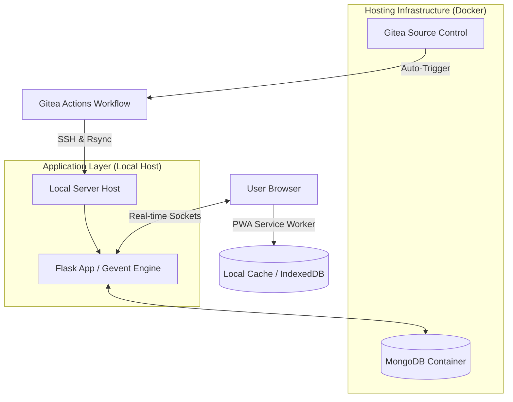

# FBIHM Inventory Engine: Professional Architecture & Deployment

## 🚀 Overview
The **FBIHM Inventory Engine (v3.0)** is a high-performance, real-time inventory management and Point-of-Sale (POS) system. It features a robust **PWA Offline-First** capability, allowing business operations to continue even without internet connectivity.

---

## 🏗️ Infrastructure Architecture

The system utilizes a **Hybrid Deployment Strategy** to balance professional-grade infrastructure with maximum application compatibility.

### 1. Infrastructure Layer (Docker)
We use **Docker** to host the core foundational services of the system. This ensures that the heavy lifting of the database and source control is isolated, secure, and easy to manage.
*   **Gitea:** Our private Git server for hosting all source code and managing development.
*   **MongoDB:** A high-performance NoSQL database containerized for reliability and data persistence.

### 2. Application Layer (Local Server Hosting)
The website itself is hosted **locally on the server** (outside of a container). 
*   **Why Local?** We chose this method because the website requires advanced system-level libraries and specific networking engines (like `Gevent`) that are more stable and performant when running directly on the host hardware. 
*   **Environment:** Runs in a dedicated Python 3.12+ virtual environment.

### 3. Automation Layer (Gitea Actions)
We utilize **Workflows (CI/CD)** to make updating the website seamless.
*   **Process:** Whenever code is pushed to the `v2` or `main` branches on Gitea, a workflow automatically triggers.
*   **Method:** The workflow uses **Secure SSH and Rsync** to sync the latest files to the server, install any required Python dependencies, and restart the Flask application automatically.
*   **Auto-Restart:** The remote deploy step stops any running app on port `5000`, launches the Flask app in the server virtual environment, and verifies that the process started successfully.

---

## 📴 PWA Offline Mode: Fully Operational
The website is a fully-featured **Progressive Web App (PWA)** designed for high reliability in areas with poor connectivity.

*   **Offline Actions:** Users can still **Add New Items**, perform **POS Checkouts**, **Restock**, and use the **Bulletin Board** while disconnected.
*   **Background Sync:** All offline actions are saved in the browser's local database (IndexedDB) and are automatically synchronized to the server the moment the connection returns.
*   **Visual Identification:** The top bar includes a real-time status indicator (**ONLINE** in green / **OFFLINE** in yellow) so staff always know their connection status.

---

## 🗺️ System Process Map

---

## 🛠️ Technical Stack

-   **Hosting:** Hybrid (Docker + Local Server Sync)
-   **Source Control:** Gitea (Self-Hosted)
-   **Backend:** Python 3.12+, Flask, Gevent (High Concurrency)
-   **Database:** MongoDB 8.0+
-   **Real-time:** WebSockets via Socket.io
-   **Frontend:** PWA (Service Workers), Bootstrap 5.3, Chart.js

---
*Last Updated: March 2026 | FBIHM Team Technical Documentation*

## Current Deployment Status
- **Main Server:** 74.208.174.70
- **Auto-Deploy:** Enabled (Gitea native)
- **Deployment Branch:** `v2` and `main`
