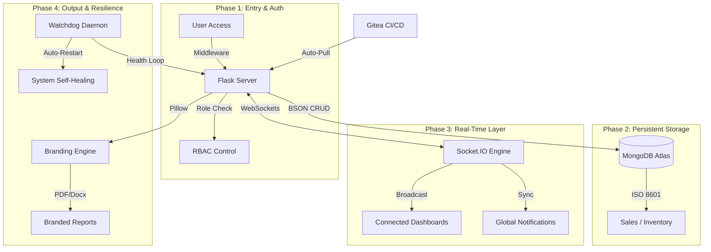

# FBIHM team Inventory Engine: System Summary & Process Map

## 🚀 Overview
The FBIHM team Inventory Engine (v2.6.0) is a high-performance, real-time inventory management and POS system. It features a professional "Facebook-inspired" aesthetic with glassmorphism, standardized ISO 8601 data integrity, and enterprise-grade reporting capabilities including custom business branding.

---

## 🗺️ System Operation Process Map (Mermaid)

---

## 🌐 How the System Works: A 7-Step Breakdown
The FBIHM team Inventory Engine operates through a layered architecture designed for professional environments and high-speed data integrity.

1. **Professional Entry Point (User Access)**
   * **Authentication:** The Flask Web Server (`app.py`) uses specialized decorators to ensure only authorized users access the system.
   * **Custom UI:** The interface follows a modernized Blue-Light aesthetic with high-density layouts optimized for large-screen monitoring.

2. **Data Integrity Standard (ISO 8601)**
   * **Global Standard:** The system utilizes strict ISO 8601 sortable date-time formats (`YYYY-MM-DDTHH:MM:SS`) across all business logs.
   * **Robust Parsing:** A centralized utility ensures legacy and new date formats are parsed safely, preventing application crashes during data migration.

3. **The "Heartbeat" (Real-time Sync)**
   * **WebSockets:** Uses Socket.io for bi-directional communication.
   * **Instant Badge Updates:** Sidebar notifications for low stock and system alerts are pushed instantly and clear persistently across all connected sessions.

4. **The Data Engine (MongoDB Atlas)**
   * **Hybrid Schema:** Stores diverse collections including `items`, `sales`, `menus`, and `notes`.
   * **Standardized Logic:** Atomic updates handle profit margins and automated stock movements to prevent "race conditions" during peak POS hours.

5. **Branded Intelligence (Reporting Engine)**
   * **Dynamic Reports:** Generates professional PDF, Word, and Excel sales summaries.
   * **Custom Branding:** Owners can upload business logos and profile pictures that are automatically embedded into generated reports using the Pillow imaging engine.

6. **The Self-Healing Brain (Watchdog)**
   * **24/7 Supervision:** A background Bash daemon monitors the Flask and MongoDB processes every 10 seconds.
   * **Auto-Recovery:** If any core service crashes, the watchdog identifies the failure and restarts the engine automatically.

7. **Proactive Alerts & Maintenance**
   * **Notification Hub:** Pushes real-time alerts for low stock thresholds.
   * **Data Purge:** A master maintenance mode allows for clean system resets, wiping all business history while preserving user accounts and settings.

---

## 🤖 Automation & Self-Healing
The system is designed for **Zero-Intervention Operations**, maintaining 24/7 uptime through background automation.

1. **Self-Healing Watchdog (`watchdog.sh`)**
   * **Process Monitoring:** Continuous polling ensures the server engine remains active.
   * **Session Persistence:** Notification badges and UI states are maintained through server-side state management.

2. **Automated Health Scanner (`scanner.py`)**
   * **Crawler Logic:** Automatically identifies 404/500 errors across all routes.
   * **Security Audit:** Proactively checks for missing headers and prevents sensitive file exposure.

---

## 🎓 Educational Advantages
The FBIHM team Inventory Engine is an ideal learning platform for students exploring full-stack engineering and professional system standards.

1. **Python & Flask (The "Micro" Advantage)**
   * **Modular Blueprints:** Teaches students how to break down complex apps into manageable sections (Auth, Sales, Inventory, Admin).
   * **Async Patterns:** Demonstrates how to handle concurrent real-time events.

2. **Standardized Data Handling**
   * **ISO Standards:** Teaches the importance of sortable, global date-time formats in business software.
   * **Imaging Logic:** Shows how to manipulate media (Pillow) for professional output generation.

---

## 🛠️ Technical Components
1. **Backend Layer:** Flask 3.x, Socket.io, Pillow (Imaging), FPDF (PDF Generation).
2. **Storage Layer:** MongoDB Atlas (Remote Cluster).
3. **CI/CD:** Integrated Gitea deployment workflow.

---

## 🔑 Security & Guardrails
* **Master Authorization:** Critical overrides require specialized codes and owner-level role checks.
* **Master Purge:** Surgical deletion of business records to ensure data privacy during handover.
* **Audit Integrity:** Comprehensive tracking of IP addresses and timestamps for every system modification.

---

**Last Updated: 2026-04-11 | FBIHM team Technical Documentation v2.6.0**
