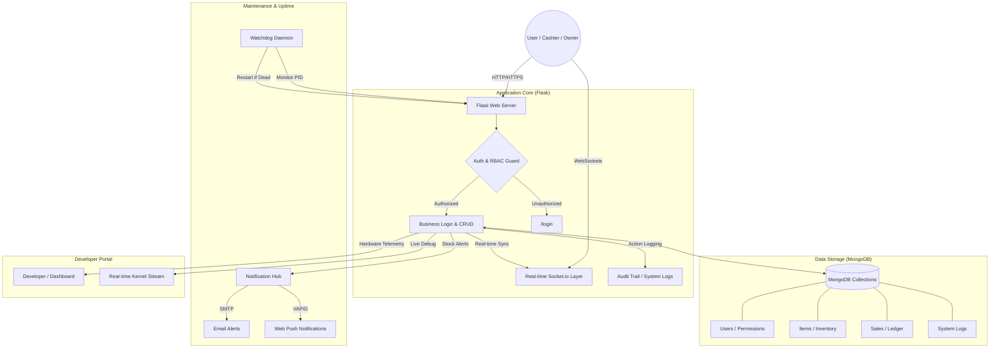

# FBIHM Inventory Engine: System Summary & Process Map

## 🚀 Overview
The **FBIHM Inventory Engine (v2.5.1)** is a high-performance, real-time inventory management and Point-of-Sale (POS) system. Designed for small-to-medium enterprises (SMEs), it replaces manual record-keeping with an automated, self-healing digital platform built on Python, Flask, and MongoDB.

---

## 🗺️ System Process Map (Mermaid)

---

## 🌐 How the System Works: A 6-Step Breakdown
The FBIHM Inventory Engine operates through a layered architecture designed for speed, security, and reliability.

1.  **Entry & Authentication:** Users access the system via a secure login. The backend uses **Role-Based Access Control (RBAC)** to ensure that owners have full oversight while cashiers only see the tools they need (like the POS).
2.  **Point-of-Sale (POS) Interaction:** A cashier selects items. The system performs a **Real-time Stock Validation** to ensure the item is available before allowing the sale to proceed.
3.  **Atomic Processing:** Once "Checkout" is clicked, the server performs an **Atomic Operation** in MongoDB. It deducts stock, creates a sale record, and generates an audit log simultaneously to prevent data corruption.
4.  **Real-Time Synchronization:** Instantly, the server broadcasts a `dashboard_update` event via **Socket.io**. This updates the charts and stock badges on every connected computer in the building without refreshing the page.
5.  **Proactive Alerting:** If the sale causes an item to hit its "Low Stock Threshold," the **Notification Hub** automatically triggers an SMTP email alert to the store owner.
6.  **Self-healing Supervision:** Throughout this process, the **Watchdog Daemon** runs in the background. If the database or server ever trips, the watchdog catches it and restarts the service in under 10 seconds.
7.  **Offline-First Resilience:** Using a **Service Worker (v4.0)**, the system caches the main UI (Dashboard, Items, POS). Even if the local network is disconnected, users can still view their last-recorded data and receive a "Disconnected" alert instead of a broken page.

---

## 🤖 Automation & Self-Healing
The system is built for **High Availability**, meaning it is designed to stay online 24/7 with zero human intervention.

### 1. **Watchdog script (`watchdog.sh`)**
- Monitors the Process ID (PID) of both the MongoDB database and the Flask web server.
- If a service stops, it logs the failure and executes a recovery command immediately.

### 2. **Metric Engine**
- Automatically calculates complex business metrics like **Profit Margin**, **Total Inventory Value**, and **Sales Velocity** every time the dashboard is viewed.

---

## 🎓 Educational Advantages: Why this Stack for Students?
The FBIHM project serves as a model for modern full-stack development methodologies.

- **Python & Flask:** Teaches "Micro-service" thinking and fundamental HTTP request handling without the complexity of heavy "Black-box" frameworks.
- **NoSQL (MongoDB):** Demonstrates the power of flexible data schemas, allowing students to understand how modern apps handle irregular data.
- **Event-Driven Architecture:** Introduces students to WebSockets and real-time state management, a critical skill for 2026 software engineering.

---

## 🛠️ Technical Components

-   **Backend:** Python 3.13, Flask 3.1.3, Eventlet.
-   **Database:** MongoDB (NoSQL) with PyMongo driver.
-   **Real-time:** Flask-SocketIO (WebSockets).
-   **Frontend:** HTML5, CSS3 (Flexbox/Grid), Bootstrap 5.3, Vanilla JavaScript.
-   **Visuals:** Chart.js for data visualization.
-   **Automation:** Bash Scripting for system-level monitoring.

---

## 🔑 Security Architecture
-   **Data Protection:** PBKDF2 Password Hashing with Salts.
-   **Traffic Security:** Strict **Content Security Policy (CSP)** and **X-Frame-Options** to prevent XSS and Clickjacking.
-   **Operational Security:** **Code 67** authorization guard for sensitive administrative changes.
-   **Accountability:** Global Audit Trail tracking user actions, timestamps, and IP addresses.

---
*Last Updated: March 2026 | FBIHM Team Technical Documentation*

## Automated Deployment Enabled
- **Target Server:** 74.208.174.70
- **Method:** SSH + rsync
- **Last Deploy Triggered:** Sat Mar 28 10:33:52 AM CDT 2026
