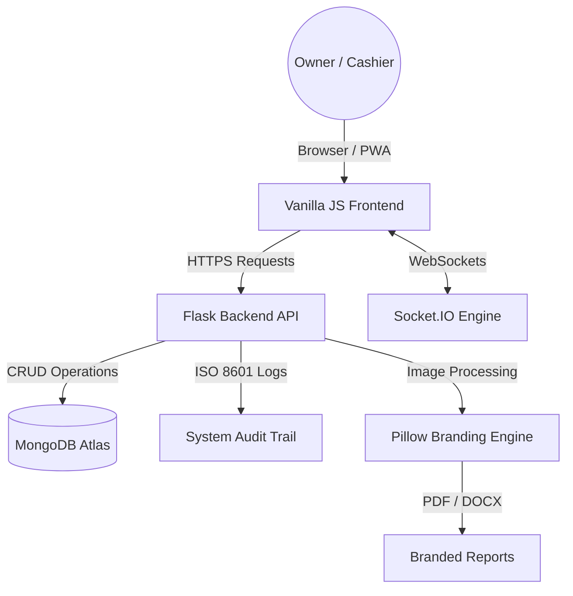
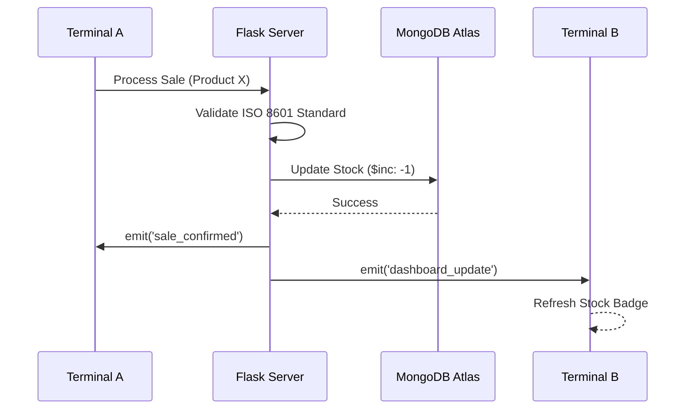

# System Design & Architecture: FBIHM Inventory Engine

This document provides a technical blueprint of the **FBIHM Inventory Engine**, explaining the interaction between its professional data layers and real-time event systems.

---

## 1. High-Level Architecture
The system follows a **Monolithic Modular Architecture** built on the **Model-View-Controller (MVC)** pattern, optimized for professional performance.

## 2. Professional Data Flow (ISO 8601)
1.  **Input:** A cashier clicks "Sell" on the POS screen.
2.  **Processing:** 
    - The Backend validates stock and Issuer credentials.
    - Every transaction is timestamped using a **Strict ISO 8601 Format** (`YYYY-MM-DDTHH:MM:SS`).
    - A specialized utility, `core.utils.parse_timestamp`, ensures all historical and incoming data is handled safely across modules.

## 3. Database Schema (NoSQL)
### Key Collections:
- **`users`:** Credentials, RBAC roles, and individual `profile_pic` paths.
- **`items`:** Central inventory with dynamic categories.
- **`purchase` / `sales`:** Transaction logs with revenue and profit metrics.
- **`menus`:** Structural data for the navigation system.
- **`inventory_log`:** Detailed audit trail of all "IN" and "OUT" movements.
- **`settings`:** Global config storage, including `business_logo` and `thresholds`.

## 4. Professional Frontend Components
- **Dashboard:** Chart.js integration for real-time sales telemetry.
- **Sidebar Persistence:** Dynamic badge management for low stock and messages.
- **Glassmorphic UI:** Modern CSS architecture using variables for themed "Facebook" aesthetics.

## 5. Security & Processing Modules
- **Metric Engine:** computes real-time profit and sales performance.
- **Branding Engine:** Utilizing Pillow for RGBA to PNG conversion for report embedding.
- **Standardization Utility:** `parse_timestamp` provides a global safeguard against malformed date strings.

## 6. Self-Healing & Deployment
- **Watchdog Daemon:** Monitors PIDs for Flask and MongoDB, providing auto-restart capabilities.
- **Gitea Integration:** Automated push/repush workflows for continuous integration and versioning.
- **Master Purge Controller:** Logic for surgical business wipes without compromising system infrastructure.

---
**Last Updated: 2026-04-11 | Version 2.6.0 Design Blueprint**
