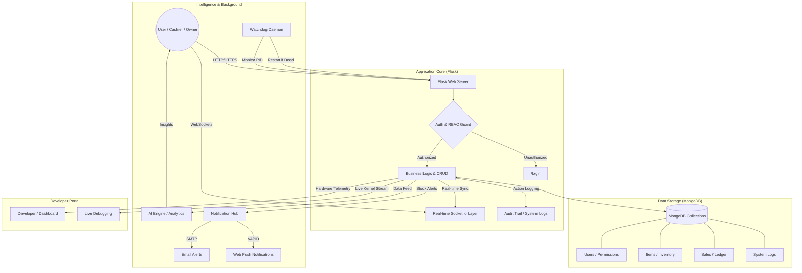

# fbihm team Inventory Engine: System Summary & Process Map

## 🚀 Overview
The **fbihm team Inventory Engine (v2.5.1)** is a high-performance, real-time inventory management and POS system. It is built using a modern technical stack featuring Flask, MongoDB, and WebSockets (Socket.io), designed with a "Hacker-Aesthetic" and enterprise-grade security.

---

## 🗺️ System Process Map (Mermaid)

---

## 🤖 Automation & Self-Healing
The system is designed for **Zero-Intervention Operations**, using background daemons and automated logic to maintain 24/7 uptime and data integrity.

### 1. **Self-Healing Watchdog (`watchdog.sh`)**
- **Continuous Monitoring:** A background Bash daemon polls the system every 10 seconds.
- **Auto-Recovery:** 
    - **MongoDB:** If the database service crashes, the watchdog auto-forks a new `mongod` instance.
    - **Flask Engine:** If the web server dies, the watchdog triggers a `nohup` restart immediately.
- **Dependency Handling:** If MongoDB fails, the watchdog automatically kills and restarts the Flask app to ensure a fresh, stable connection upon DB recovery.

### 2. **Automated Health Scanner (`scanner.py`)**
- **Crawler Logic:** Systematically traverses the internal site structure (up to 50 pages).
- **Broken Link Detection:** Automatically identifies 404 errors and 500 server errors across all routes.
- **Security Audit:** 
    - Proactively checks for missing headers (CSP, X-Frame-Options).
    - Probes for exposed sensitive files like `.env`, `.git`, and `config.py`.

### 3. **Business Logic Automation**
- **Metric Engine:** Automatically computes item-specific metrics (Profit, Margin %, Total Revenue) upon every sale transaction.
- **Stock Threshold Alerts:** Triggers SMTP and VAPID notifications the moment stock levels fall below the custom "Low Stock" threshold.
- **Sales Velocity AI:** Algorithmic detection of "Cold Stock" (items unsold for 30+ days) and "Sporadic Sellers" to assist in inventory optimization.

---

## 🎓 Educational Advantages: Why this Stack for Students?
The fbihm team Inventory Engine is an ideal learning platform for students exploring full-stack engineering.

### 1. **Python & Flask (The "Micro" Advantage)**
- **Readability:** Python's clean syntax allows students to focus on logic rather than boilerplate.
- **Fundamentals:** Flask is a "micro-framework," meaning it doesn't hide the underlying HTTP request/response cycle. Students learn how routing, sessions, and headers actually work.

### 2. **MongoDB (Schema Flexibility)**
- **NoSQL Learning:** Students can explore data relationships without the steep learning curve of complex SQL joins and migrations.
- **JSON-Native:** Since the frontend and backend communicate via JSON, using a document store like MongoDB makes the data flow intuitive.

### 3. **Real-World Patterns**
- **WebSockets:** Teaches real-time bi-directional communication (Socket.io).
- **Security:** Demonstrates RBAC (Role-Based Access Control) and the importance of audit trails.
- **Self-Healing:** Introduces concepts of system reliability and process monitoring via the Bash Watchdog.

---

## 🛠️ Technical Components

### 1. **Backend Layer (Flask 3.x)**
- **Eventlet:** Monkey-patched for high concurrency and async execution.
- **Socket.io:** Powers real-time telemetry, user tracking, and instant theme synchronization.
- **RBAC:** Dynamic Permission Matrix allows Owners to toggle visibility for Cashiers per module.

### 2. **Storage Layer (MongoDB)**
- **Flexible Schema:** Handles complex inventory data and nested sales objects.
- **Collections:** `users`, `items`, `sales`, `system_logs`, `categories`, `notes`, `subscriptions`, `settings`.

### 3. **AI & Diagnostics**
- **AI Engine (`ai_engine.py`):** Designed for strategic insights (currently in "Disabled" mode to save costs).

---

## 🔑 Security & Guardrails
- **Code 67:** A specialized security authorization code required for modifying Owner account details.
- **Audit Integrity:** Proxy-aware IP address tracking for every system modification.
- **Maintenance Mode:** Owner-controlled lock on the system for data restoration or updates.

---
*Created on 2026-03-12 | fbihm team Technical Documentation*
