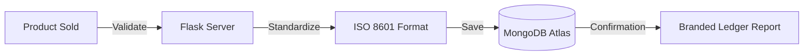
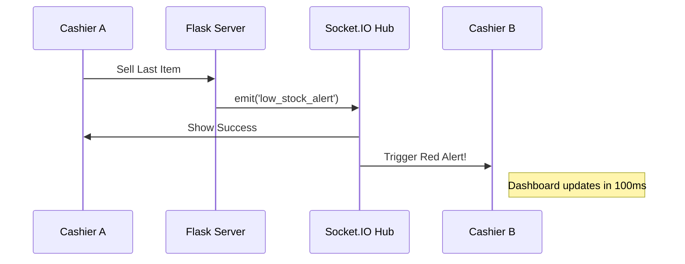

# The Simple Guide to the FBIHM Inventory Engine
*(Perfect for explaining your thesis to anyone!)*

Imagine you own a **Toy Store**. This project is like a **Magic Notebook** that helps you run that store without making any mistakes.

---

## 1. What is this project?
In the old days, store owners used paper notebooks. They would write down: *"I sold 1 car today."* But sometimes they forgot, or they lost the book!

**FBIHM** is a digital version of that notebook. It lives on a computer, it never forgets, it's branded with your logo, and it does all the math for you.

---

## 2. The Four "Superpowers" of the System

### Superpower 1: The Smart Cash Register (POS)
When a customer comes to buy a toy, the cashier just clicks a button. 
- **Simple explanation:** It’s like a calculator that also talks to your toy shelf. When you click "Sell," the shelf automatically knows there is one less toy.

### Superpower 2: Magic Walkie-Talkies (Real-Time)
If you have two cash registers, they need to talk to each other.
- **Simple explanation:** If Register A sells the last Teddy Bear, Register B finds out **instantly** through a "magic walkie-talkie" (we call this **SocketIO**). Register B will show a red light saying "Out of Stock!" before the cashier even tries to sell it.

### Superpower 3: The Global Clock (ISO 8601)
Store owners need to know exactly when a sale happened, even if they have stores in different cities.
- **Simple explanation:** We use a special "Global Clock" format (we call this **ISO 8601**). It ensures every notebook entry is sorted perfectly from first to last, so the reports are never confusing.

### Superpower 4: The Robot Guard (Watchdog)
Sometimes computers get tired and stop working (crash).
- **Simple explanation:** We have a **Robot Guard** script. Every 10 seconds, it pokes the system and asks, *"Are you awake?"* If the system fell asleep, the Robot Guard wakes it up immediately so the store can keep selling!

---

## 3. How we built it (The Tools)

| The Tool | What it is in "Kid Language" | Technical Name |
| :--- | :--- | :--- |
| **Python** | The **Manager** who makes all the decisions. | **Primary Backend Language** |
| **Flask** | The **Office** where the Manager works. | Web Framework (Python) |
| **JavaScript** | The **Magic Tricks** that make buttons move. | **Frontend Scripting Language** |
| **Pillow** | The **Artist** who draws your logo on reports. | Imaging Library |
| **MongoDB** | The **Giant Toy Box** where we store all our notes. | Database (NoSQL) |
| **ISO 8601** | The **Perfect Calendar** that keeps things in order. | Data Standardization |

---

## 4. A Real-Life Example (How it works)

Let's say you have **10 Apples** in your store.

1.  **The Customer:** A kid wants to buy **2 Apples**.
2.  **The Cashier:** Opens the **FBIHM POS screen**, clicks "Apple" twice.
3.  **The System (The Manager):** 
    - Checks the Toy Box: *"Do we have 10 apples? Yes!"*
    - Does the math: *10 minus 2 equals 8.*
    - Timestamp: It records the time as `2026-04-11T12:00:01` (ISO 8601).
4.  **The Receipt:** A professional PDF pops out showing **your store logo** at the top!
5.  **The Dashboard:** Instantly, the owner's computer updates a graph showing: *"Yay! You made profit today!"*
---

## 4. Visualizing the Magic (For the Defense Panel)
During your presentation, you can use these maps to explain the complex "invisible" parts of your system.

### **The Sale Flow (How data stays safe)**

### **The Real-Time Sync (Dual-Terminal Update)**

---

## 5. Frequently Asked Questions (The "Thesis" Part)

**Q: Why use ISO 8601 dates?**
**A:** We use the international standard `YYYY-MM-DDTHH:MM:SS` format. This ensures that sales records are perfectly sortable and that we can generate accurate hourly, daily, and monthly reports without any time-zone or formatting errors.

**Q: How do you handle Custom Branding?**
**A:** We integrated the **Pillow** imaging engine. This allows the Owner to upload a business logo in the settings, which the system then converts and embeds directly into professional PDF and Word reports.

**Q: Why use a "NoSQL" Database like MongoDB Atlas?**
**A:** It allows for a **Hybrid Schema**. Retail items are irregular; a "Car" has a color, but a "Drink" has a volume. MongoDB lets us store these different types of information in one place easily.

---

## 6. Teacher's Corner: In-Depth Q&A for v2.6.0

**Q1: Explain the shift to strict data integrity standards like ISO 8601 in your recent updates.**

**A1:** One of the primary challenges in inventory systems is temporal data consistency. In previous versions, varying date formats in the `purchase` and `sales` collections caused sorting issues and potential application crashes during report generation. In version 2.6.0, we standardized the entire backend to use **ISO 8601** (`YYYY-MM-DDTHH:MM:SS`). This format is lexicographically sortable, making database queries for time-ranges extremely efficient. We implemented a centralized utility, `parse_timestamp`, which acts as a safeguard, allowing the system to bridge legacy data with the new standard without losing historical accuracy.

**Q2: Describe how the reporting engine handles custom business branding (logos and profile pictures).**

**A2:** Professionalization was a key requirement for the thesis. We implemented a branding module utilizing the **Pillow (PIL)** library. When an owner uploads a business logo (JPG/PNG), the system stores it in a secure static directory. During report generation (via `fpdf2` or `python-docx`), the system retrieves this logo, ensures it is in a compatible RGBA/PNG format using Pillow, and dynamically positions it on the report header. This provides an "enterprise-grade" output that is missing in most basic inventory prototypes.

**Q3: Describe the "Magic Walkie-Talkies" (SocketIO) persistence logic.**

**A3:** In a multi-terminal environment, real-time sync isn't just about sales; it's about system state. When a "Low Stock" event occurs, a notification badge is emitted via Socket.io. Crucially, we implemented **badge persistence**. When a user clears a notification on one terminal, a `clear_notification` event is broadcast globally, ensuring that the "Alert Badge" disappears from all connected dashboards simultaneously. This creates a cohesive "Command Center" experience.

**Q4: Data Structures in MongoDB - How is the `menus` collection utilized?**

**A4:** The `menus` collection is a critical addition in v2.6.0. It decouples the UI navigation from the hardcoded routes. This allows the Owner to dynamically control what sections of the app (Categories, Bulletin, Sales) are visible to different user roles. By storing this in MongoDB, we can backup and restore the entire "Business Layout" alongside the inventory data, ensuring that a system restoration brings back the exact UI configuration the owner previously established.

**Q5: Rationale for Gitea-based CI/CD workflows?**

**A5:** While GitHub is standard for public projects, Gitea was chosen for this thesis to demonstrate **self-hosted infrastructure control**. By managing our own Git remote (`thesis.fbihm.online`), we ensure that the business source code remains private and that the owner has 100% control over the deployment pipeline. This aligns with the "privacy-first" approach of small business software.

---
**Last Updated: 2026-04-11 | Thesis Version 2.6.0**
